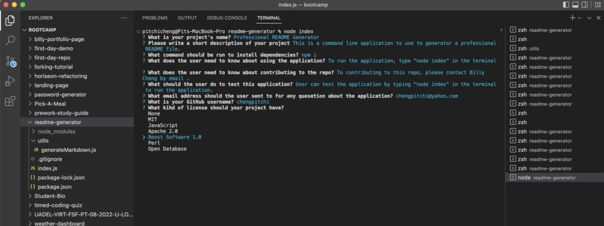
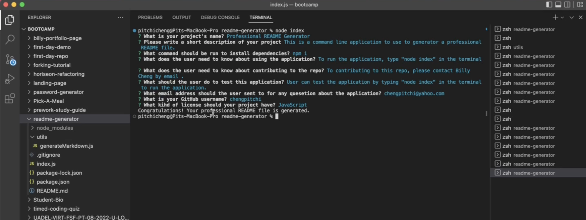
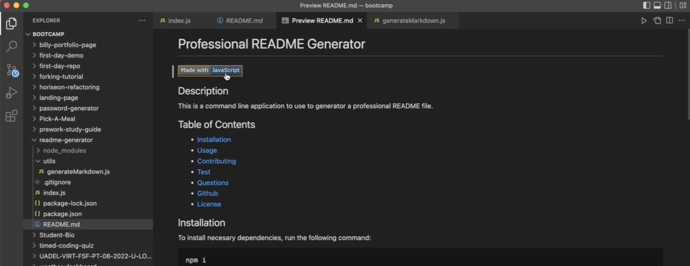
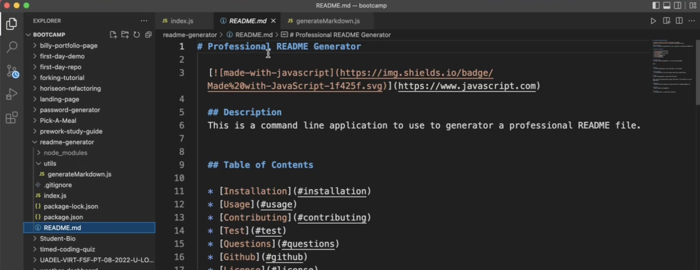

# Professional README Generator

  [](https://www.javascript.com)

  ## Description 
  This is a command line application to use to generator a professional README file.
  

  ## Table of Contents
  
  * [Installation](#installation)
  * [Usage](#usage)
  * [Contributing](#contributing)
  * [Test](#test)
  * [Walkthrough Video](#walkthrough-video)
  * [Screenshots](#screenshots)
  * [Questions](#questions)
  * [Github](#github)
  * [License](#license)
  

  ## Installation
  To install necesary dependencies, run the following command:
  
  ```
  npm i 
  ```
  

  ## Usage
  > To run the application, type "node index" in the terminal 
  

  ## Contributing
  > To contributing to this repo, please contact Billy Cheng by email .
  

  ## Test 
  To test the application, please follow the below:

  ```
  User can test the application by typing "node index" in the terminal to run the application. 
  ```

  ## Walkthrough Video
  https://drive.google.com/file/d/1yI9H1-GVaLanOzskfqhZVzOPRkAu0bvY/view
  
  ## Screenshots
  

  

  

  

  ## Questions
  > Should you have any questions, please send email to chengpitchi@yahoo.com. 
  

  ## Github
  > https://github.com/chengpitchi
  
  
  ## License 
  > This applicaiton is covered under JavaScript.
